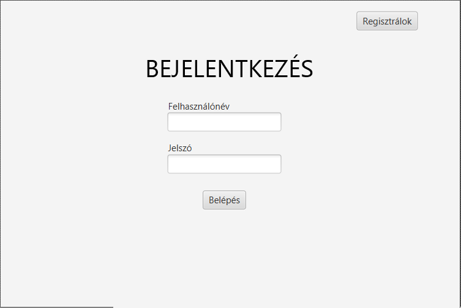
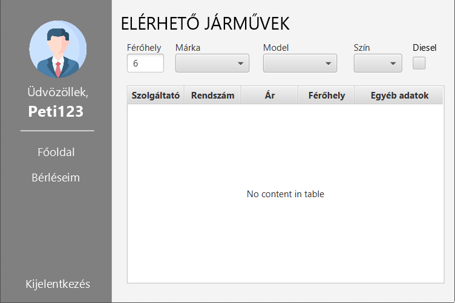
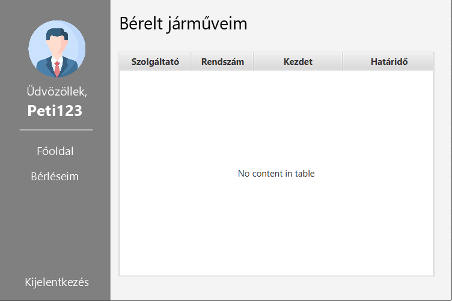
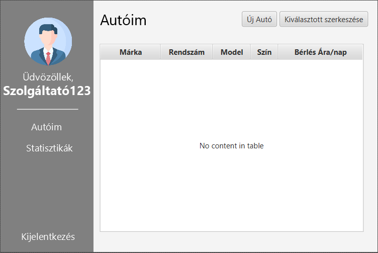
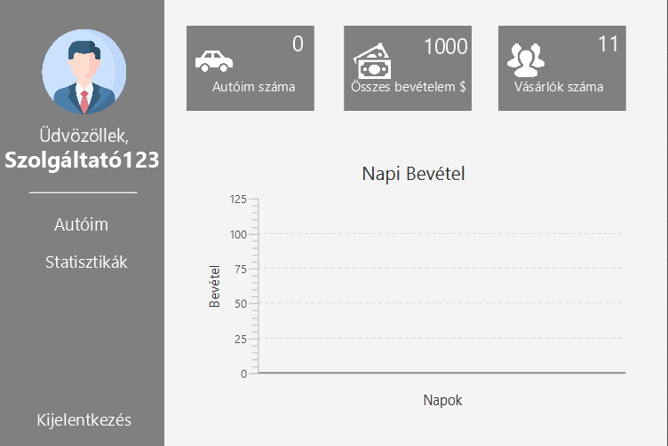

# AutoMates
## 📖 Tartalomjegyzék
- [📖 Tartalomjegyzék](#-tartalomjegyzék)
- [☝️ Általános információ](#️-általános-információ)
- [📝 Az adatbázis felépítése](#-az-adatbázis-felépítése)
- [📝 Written in](#-written-in)
- [📝 Főbb oldalak](#-főbb-oldalak)
- [⭐️ Kapcsolat](#️-kapcsolat)

## ☝️ Általános információ
Autó kölcsönző és bérbeadó alkalmazás Java alatt, mavennel - Szoftverfejlesztés mérnököknek projekt. 
Ebben az alkalmazásban a felhasználókat 2 részre osztjuk, az egyik a bérbe adók, a másik pedig a bérbe vevők. 
Ennek megfelelően a különböző felhasználók különböző felületeket látnak és érnek el. 
Az alkalmazás a felhasználók adatait helyi számítógépen, egy adatbázisban tárolja el.

## 📝 Az adatbázis felépítése
Az adatbázis felépítése részletesebben [itt](https://dbdiagram.io/d/652e9ed5ffbf5169f0df1ae0) megtalálható!
 

## 📝 Written in
Java with Maven.

## 📝 Főbb oldalak
  
  
 És legvégül két átlagos oldal, egy a bejelentkezésre, egy pedig a regisztrációra. 
 Ami viszont lényeges hogy itt válik el hogy valaki bérlő vagy bérbeadó akar lenni, később nincs lehetőség változtatni.   

 
 
A felületen szerepelnek szövegek, számbeviteli mezők, választó dobozok, jelölőnégyzetek, valamint egy táblázat, 
amelyben járműadatok jelennek meg. A felhasználó képes lehet járművek keresésére a különböző tulajdonságok alapján, 
és a találatokat a táblázatban megtekintheti. Emellett két gomb is található a bérlés és a keresés funkciók aktiválására.   

 
 A "Bérléseim" funkciót valósítja meg, amely egy táblázatban jeleníti meg a bérelt járművek tulajdonosát, rendszámát, a bérlés kezdetét és a végét.   

  
 A felületen a bérbeadó felhasználó adatait jeleníti meg egy táblázatban, amelyben az autók adatai jelennek meg, márka, 
 rendszám, modell, szín, és a bérlés ára naponta. Két gomb is szerepel a felületen: az "Új Autó" gomb a hozzáadás funkciót szolgálja, 
 míg a "Kiválasztott szerkesztése" gomb a kiválasztott autó szerkesztését teszi lehetővé.   

  
 Autók száma: Azt mutatja, hány autóval rendelkezik a felhasználó.
 Összes bevétel: A felhasználó összes edigi bevétele forintban.
 Vásárlók száma: A felhasználónak hány bérlője volt eddig (az ismétlődőket nem számoljuk).
 A felület alsó részén található egy oszlopdiagram (BarChart), amely a napi bevételeket mutatja napok szerint kategorizálva.   

## ⭐️ Kapcsolat
 Készítették: [@csuka1219](https://github.com/csuka1219), [@BOXi-Mark](https://github.com/BOXi-Mark), [@SmBird027](https://github.com/SmBird027) és [@Markol0](https://github.com/Markol0) 
