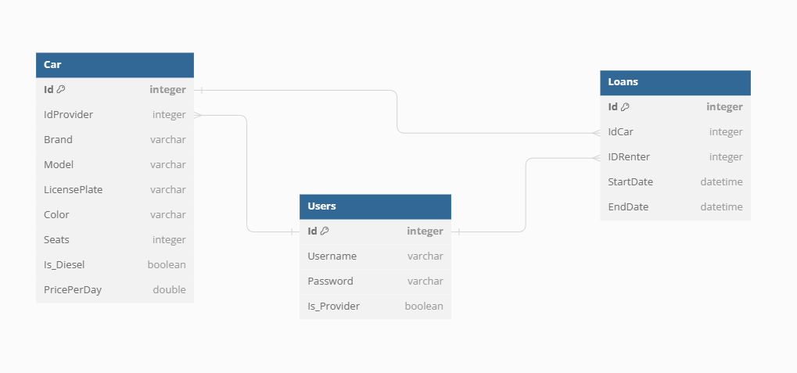

# AutoMates
## 📖 Tartalomjegyzék
- [📖 Tartalomjegyzék](#-tartalomjegyzék)
- [☝️ Általános információ](#️-általános-információ)
- [📝 Az adatbázis felépítése](#-az-adatbázis-felépítése)
- [📝 Written in](#-written-in)
- [⭐️ Kapcsolat](#️-kapcsolat)

## ☝️ Általános információ
Autó kölcsönző és bérbeadó alkalmazás Java alatt, mavennel - Szoftverfejlesztés mérnököknek projekt. 
Ebben az alkalmazásban a felhasználókat 2 részre osztjuk, az egyik a bérbe adók, a másik pedig a bérbe vevők. 
Ennek megfelelően a különböző felhasználók különböző felületeket látnak és érnek el. 
Az alkalmazás a felhasználók adatait helyi számítógépen, egy adatbázisban tárolja el.

## 📝 Az adatbázis felépítése
Az adatbázis felépítése részletesebben [itt](https://dbdiagram.io/d/652e9ed5ffbf5169f0df1ae0) megtalálható!

## 📝 Written in
Java with Maven.

## ⭐️ Kapcsolat
Készítették: [@csuka1219](https://github.com/csuka1219), [@BOXi-Mark](https://github.com/BOXi-Mark), [@SmBird027]([https://github.com/czegenypatrik](https://github.com/SmBird027)) és [@Markol0](https://github.com/Markol0) 
